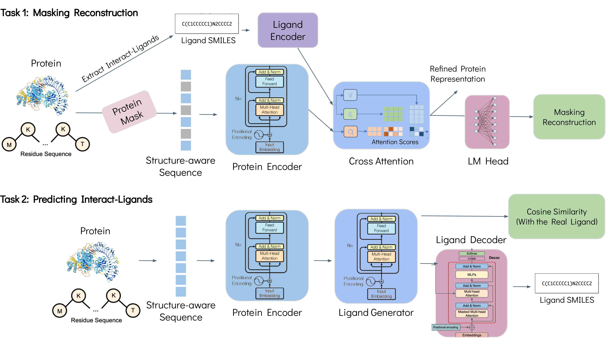
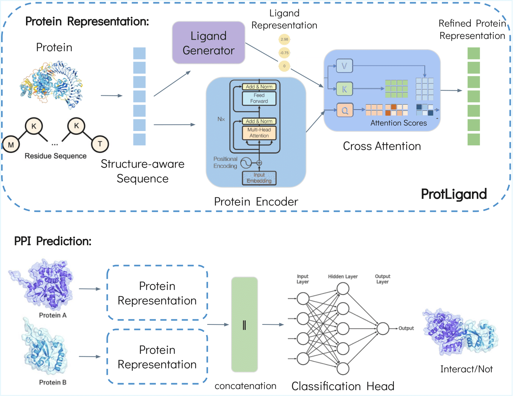

# Leaderboard: Leveraging Predictive Modeling for Protein-Ligand Insights and Discovery
## Dan Kalifa, Kira Radinsky, Eric Horvitz

The repository is the official implementation of the paper: "Leaderboard: Leveraging Predictive Modeling for Protein-Ligand Insights and Discovery".
The paper is under review for the Bioinformatics journal by Oxford.

## ProtLigand - Pre-training Overview


## ProtLigand - Inference Overview
An example of using the ProtLigand model for the HumanPPI classification task:


Some code was borrowed from [SaProt](https://github.com/westlake-repl/SaProt) repository, which is our base PLM used by ProtLigand. 

## Environment installation
### Create a virtual environment
```
conda create -n ProtLigand python=3.10
conda activate ProtLigand
```
### Install packages
```
bash environment.sh  
```

## Prepare ProtLigand
### Model checkpoints
We provide the weights for the [ProtLigand](https://drive.google.com/file/d/1eDy9X_aZnCSlSNNPk8vw0gi9Eu6iSNJY/view?usp=sharing) model, and the [Ligand Generator](https://drive.google.com/file/d/1Oyq4uQYaqeBBsAXedbnUs3YKbXjIQ1TI/view?usp=sharing) model.
After downloading, place these files in the appropriate `weights/` folder.

### Experimental results
Some experimental results are listed below. For more details, please refer to our paper. For the fine-tuning tasks, the datasets were split based on 30% sequence identity.

## Prepare dataset
### Pre-training dataset
We provide the dataset for pre-training ProtLigand. The dataset can be downloaded from
[here](https://drive.google.com/file/d/1rGJoLows72n3ShJY7171EEPrR5pm_uZ9/view?usp=sharing).
Once downloaded, the dataset needs to be decompressed and placed in the `LMDB` folder.

To train the SaProt model (the base PLM), you need the pre-training dataset, which can be downloaded from
[here](https://huggingface.co/datasets/westlake-repl/AF2_UniRef50).

### Downstream tasks
We provide datasets that are used in the paper. Datasets can be downloaded from 
[here](https://drive.google.com/drive/folders/11dNGqPYfLE3M-Mbh4U7IQpuHxJpuRr4g?usp=sharing).
Once downloaded, the datasets need to be decompressed and placed in the `LMDB` folder for supervised fine-tuning.

#### Fair evaluation 
We provide a general pre-training dataset and full benchmark datasets. For each benchmark task, especially new ones, to ensure fair and rigorous evaluation, users must remove any sequence from the pre-training set that exhibits >30% Needleman–Wunsch (NW) similarity to any test sequence before training.

## Training ProtLigand
We provide a script to train the ProtLigand and the Ligand Generator model on the pre-training dataset.

```
# Training the Ligand Generator
python scripts/training.py -c config/pretrain/ligand_generator.yaml
```
Then, update the ligand generator path in the YAML of the protligand.yaml
Also, you can train the ligand decoder using this line, with the reported hyperparameters.

```
# Training ProtLigand model
python scripts/training.py -c config/pretrain/protligand.yaml
```

## Fine-tune ProtLigand
We provide a script to fine-tune ProtLigand on the datasets. The following code shows how to fine-tune ProtLigand on specific
downstream tasks. Before running the code, please make sure that the datasets are placed in the `LMDB` folder and the
ProtLigand and Ligand Generator weights are placed in the `weights/Pretrain` folder.
**Note that the default training setting is not the same as in the paper because of the hardware limitation for different users. We recommend that users modify the YAML file flexibly based on their conditions (i.e., batch_size, devices, and accumulate_grad_batches).**

```
# Fine-tune ProtLigand on the Thermostability task
python scripts/training.py -c config/Thermostability/protligand.yaml
```

### Record the training process (optional)
If you want to record the training process using wandb, you could modify the config file and set `Trainer.logger = True`, and then paste your wandb API key in the config key `setting.os_environ.WANDB_API_KEY`.


## ProtLigand Usages

### Convert protein structure into structure-aware sequence
We provide a function to convert a protein structure into a structure-aware sequence. The function calls the 
[foldseek](https://github.com/steineggerlab/foldseek) 
binary file to encode the structure. You can download the binary file from [here](https://drive.google.com/file/d/1B_9t3n_nlj8Y3Kpc_mMjtMdY0OPYa7Re/view?usp=sharing) and place it in the `bin` folder
. The following code shows how to use it.
```python
from utils.foldseek_util import get_struc_seq
pdb_path = "example/8ac8.cif"

# Extract the "A" chain from the pdb file and encode it into a struc_seq
# pLDDT is used to mask low-confidence regions if "plddt_mask" is True. Please set it to True when
# use AF2 structures for best performance.
parsed_seqs = get_struc_seq("bin/foldseek", pdb_path, ["A"], plddt_mask=False)["A"]
seq, foldseek_seq, combined_seq = parsed_seqs

print(f"seq: {seq}")
print(f"foldseek_seq: {foldseek_seq}")
print(f"combined_seq: {combined_seq}")
```


### ProtLigand Inference - Get protein embeddings
During inference, ProtLigand can be used to generate representations of proteins. When representing a given protein, we first generate its corresponding ligand and then create the final representation. In this example, we load the ProtLigand model to obtain an embedding for each token in the input sequence.
You can optionally aggregate these token-level embeddings into a single protein-level representation using a simple pooling strategy such as `mean`.
Using the `config` dict, you can provide the path for the `ProtLigand` model and for the `Ligand Generator`. 

```python
from model.saprot.base import SaprotBaseModel
from transformers import EsmTokenizer

config = {
    "task": "base",
    "config_path": "weights/PLMs/SaProt_650M_AF2",
    "load_pretrained": True,
    "from_checkpoint": "weights/Pretrain/final_prot_ligand_model_large.pt",
    "load_generator": "weights/Pretrain/ligand_generator_model_with_decoder_big.pt"
}

model = SaprotBaseModel(**config)
tokenizer = EsmTokenizer.from_pretrained(config["config_path"])

device = "cuda"
model.to(device)

seq = "M#EvVpQpL#VyQdYaKv"  # Here "#" represents lower plDDT regions (plddt < 70)
tokens = tokenizer.tokenize(seq)
print(tokens)

inputs = tokenizer(seq, return_tensors="pt")
inputs = {k: v.to(device) for k, v in inputs.items()}

embedding = model.get_protein_representation(inputs)

print(embedding.shape)
print(embedding)
```


## Interpretability of ProtLigand
ProtLigand supports exporting raw prediction probabilities for downstream analysis or explainability.
To export raw prediction scores for a given task, specify the output path using the `test_result_path` key in your model configuration file. For example:
```yaml
test_result_path: output/HumanPPI/ProtLigand.tsv
```
Then, you can use the `explainability.py` script to generate insights, as presented in the paper.

## Citation
If you find this repository useful, please cite our paper.
